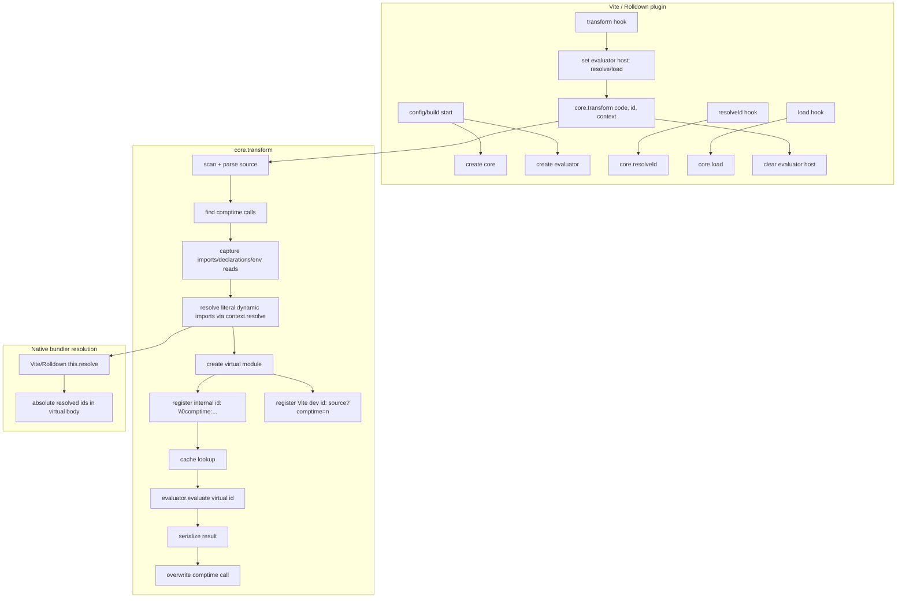
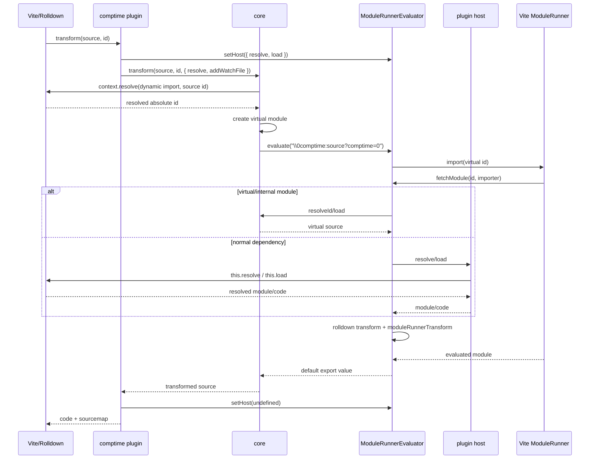

# Plugin lifecycle

## Transform flow

## Evaluation flow

## Vite dev

Vite dev follows the same core transform path, but `ViteEvaluator.evaluate()` uses
`server.ssrLoadModule(source?comptime=n)` when a dev server is available. The extra
dev id lets Vite run its normal TS/TSX transform on the generated module instead of
loading the internal `\0` id directly.
